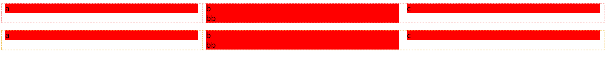

# Flex Layout

In this article, I will tell you some important points to note except the concepts of [flexiable layout](https://developer.mozilla.org/en-US/docs/Web/CSS/CSS_Flexible_Box_Layout/Basic_Concepts_of_Flexbox) that many existing articles had mention. Please learn the concepts before reading the article if you don't get it.  

## width and flex-basis
The flex layout only use **flex-basis** but not width poperty to set the basis width of elements before calculating. Only when the **flex-basis** is not provided, the value of **flex-basis** is to be set as **width** or content width automatically.  

## default value
```css
flex-direction: row;
align-items: strektch;
flex-grow: 0;
flex-shrink: 1;
flex-basis: auto; /* because the value of width is auto default */
flex-wrap: nowrap;
justify-content: flex-start;
```
Therefore, when you only set `display: flex` in container, you can find out:
* The children don't cover the whole container. **(flex-grow is zero)**
* The height of children are equal to container. **(align-items is strektch)**
* The children don't wrap even if it overflow. **(flex-wrap is nowrap)**

## shorthand
```css
flex: flex-grow flex-shrink flex-basis;
flex: 1; /* flex-grow: 1, flex-shrink: 1 */
flex: 1 0; /* flex-grow: 1, flex-shrink: 0 */
```

## grid
The code below achieves grid layout
```html
<div class="grid">
    <div class="grid-row">
        <div class="grid-col grid-col-3">
            <div class="content">
                a
            </div>
        </div>
        <div class="grid-col grid-col-3">
            <div class="content">
                b<br/>
            </div>
        </div>
        <div class="grid-col grid-col-3">
            <div class="content">
                c
            </div>
        </div>
    </div>
    <div class="grid-row">
        <div class="grid-col grid-col-3">
            <div class="content">
                a
            </div>
        </div>
        <div class="grid-col grid-col-3">
            <div class="content">
                b<br/>
            </div>
        </div>
        <div class="grid-col grid-col-3">
            <div class="content">
                c
            </div>
        </div>
    </div>
</div>
```

```css
:root {
    --gap: 1rem;
}

.grid {
    display: flex;
    flex-wrap: wrap;
}

.grid-row {
    display: flex;
    width: 100%;
    padding: calc(var(--gap) / 2) 0;
}

.grid-col {
    padding: 0 calc(var(--gap) / 2);
}

.grid-col-3 {
    width: 33.3%;
}

.content {
    background-color: red;
}
```
Result:

:::tip
we set **width: 100%** for **.grid-row** here and it equals to **flex: 0 1 100%**, but why the row's width cover container all and the flex-shrink not work? That's because it's parent to be set **flex-wrap: nowrap** which makes **flex-shrink** unused.
:::

## overflow
By default, the long text will overflow in flex layout. Here has three ways to fix this issue:
* set `min-width: 0`
* set `overflow: auto`
* set ellipsis style
```css
.ellpsis {
    text-overflow: ellipsis;
    white-space: nowrap;
    overflow: hidden;
}
```
> In my opinion, the core is to tell browser how to calculate the size of long text container which fully displayed by default.
> 1. set *min-width: 0* tells the browser that it can shrink as long as it's width longer than 0.
> 2. set *overflow: auto** tells the browser that it can shrink with scrolling box and make other items show as possible.
> 3. set ellipsis style tells the browser that it can shrink with text-overflow and make other items show as possible.

## navbar in mobile
```html
<head>
    <meta name="viewport" content="width=device-width, user-scalable=no" />
</head>

<body>
    <div class="navigation">
        <nav class="navbar">
            <a href="">Home</a>
            <a href="">Home</a>
            <a href="">Home</a>
            <a href="">Home</a>
            <a href="">Home</a>
            <a href="">Home</a>
            <a href="">Home</a>
            <a href="">Home</a>
            <a href="">Home</a>
            <a href="">Home</a>
        </nav>
        <div class="icon">...</div>
    </div>
</body>
```
```css
.navigation {
    display: flex;
}

.navbar {
    display: flex;
    overflow: scroll;
    font-size: 1.01rem;
}
```
The result is:

> In this case, the navbar is scrolling and don't make the icon invisible, that is because `overflow: scroll` prevent width of the navbar from overflow.

By the way, if you need to fix the navbar at top, you may add **position: fixed** into the **.navigation** class，but it doesn't work well. The reason of this is the navigation out of flow and the **width: auto** can't work as normal.